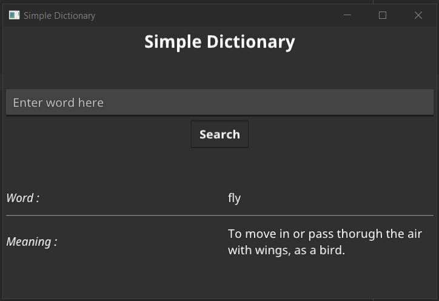

#Desktop Dictionary App

A desktop dictionary application written with golang and the fyne.io package.

Needs internet as this is connected to a free online dictionary API.

**Using this project to learn more about the fyne package and ofcourse more golang problems to solve.

